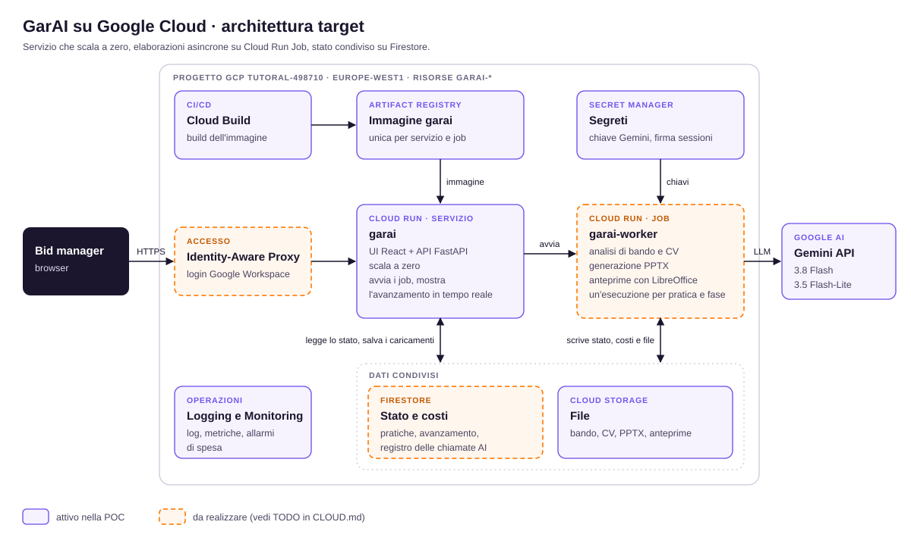

# GarAI su Google Cloud Run

Versione cloud (branch `cloud`) pensata per una POC: un servizio Cloud Run che scala a zero, dati su Cloud Storage,
nessuna licenza Microsoft.



Il diagramma mostra l'architettura **target**: in viola ciò che è già attivo nella POC, in arancio tratteggiato ciò che
resta da realizzare (vedi [TODO](#todo)).

## Come si ottiene il PowerPoint senza PowerPoint

| Funzione | Desktop (Windows) | Cloud Run (Linux) |
|---|---|---|
| Creazione del PPTX | python-pptx (clona e riempie il template) | identica |
| Misura del testo per il ciclo di fit | PowerPoint via COM: misura reale | stima con i font del template (Work Sans) e margine di sicurezza del 4% (`ESTIMATE_WIDTH_MARGIN`) |
| Anteprime delle slide | PowerPoint | LibreOffice headless (PPTX → PDF → PNG) |

Il file scaricato è un PPTX nativo e si apre in PowerPoint con i font installati sul PC. Le anteprime nell'app sono
generate da LibreOffice e possono differire di poco dall'impaginazione di PowerPoint.
Nell'immagine sono installati Work Sans (OFL, in `assets/fonts/`), Clash Display (se presente in
`assets/fonts/private/`: licenza non ridistribuibile, quindi esclusa da git), Liberation (metriche di Arial/Helvetica)
e Carlito (metriche di Calibri).

## Architettura attuale (POC)

```
utente ──HTTPS──► Cloud Run "garai" (da 0 a 1 istanza, CPU allocata finché l'istanza è attiva)
                    │  FastAPI + frontend React + LibreOffice
                    │  cartella dati locale /data  ◄──ripristino all'avvio / replica ogni 5 s──►  gs://<progetto>-garai-data
                    ├─ Secret Manager: garai-session-secret, garai-gemini-key
                    └─ Gemini API
```

- **Persistenza**: l'app lavora su disco locale come in desktop; `app/cloud_sync.py` ripristina la cartella dati dal
  bucket all'avvio e replica ogni 5 secondi i file nuovi, modificati ed eliminati (il registro costi SQLite con l'API
  di backup). Allo spegnimento dell'istanza fa un'ultima replica.
- **Scala a zero, al massimo un'istanza** (`min-instances=0`, `max-instances=1`): l'istanza è l'unica a scrivere i
  dati. Parte alla prima richiesta (avvio a freddo di 10–20 s, compreso il ripristino dal bucket) e si spegne dopo circa
  15 minuti senza traffico.
- **Elaborazioni in background** nello stesso processo, con CPU allocata per tutta la vita dell'istanza
  (`--no-cpu-throttling`). Mentre la pagina della pratica è aperta, la connessione in tempo reale tiene viva l'istanza.
  Limite noto: se si chiude il browser a metà elaborazione e nessuno usa l'app, l'istanza può spegnersi e la pratica
  risulta interrotta; si rilancia con "Riprova". Il superamento di questo limite è il primo [TODO](#todo).
- **Nuovi deploy**: durante il passaggio di revisione la vecchia e la nuova istanza restano attive insieme per qualche
  secondo. Meglio non ridistribuire mentre una pratica è in elaborazione o in modifica.
- **Isolamento**: tutte le risorse hanno prefisso `garai` ed etichetta `app=garai`. I service account dedicati hanno
  permessi solo sulle risorse garai (bucket, repository, secret), nessun ruolo di progetto oltre alla scrittura dei log
  di build.
- **Accesso**: il servizio è pubblico (`--allow-unauthenticated`); l'app richiede comunque il login.
  `TRUSTED_PROXY_HOPS=1` fa usare l'IP reale del client (aggiunto dal proxy di Google) per il blocco dei tentativi.
- **Limite di spesa mensile**: 20 USD di default (`MONTHLY_BUDGET_USD`), modificabile da Impostazioni.

## Deploy

Requisiti: `gcloud` autenticato con un account owner del progetto. Non serve Docker in locale (build con Cloud Build).

```bash
GCP_ACCOUNT=me@example.com GEMINI_API_KEY=... bash deploy/gcp.sh
```

Lo script è idempotente: crea solo ciò che manca, poi build e deploy. `SKIP_SETUP=1` per rifare solo build e deploy.

## Costi indicativi

Si paga l'istanza (2 vCPU, 2 GiB) solo mentre è attiva: circa 0,15 USD per ogni ora di attività, compresi i circa
15 minuti di inattività prima dello spegnimento; a riposo il costo è nullo. Storage, build e secret: centesimi.
Le chiamate Gemini (da 0,03 a 0,10 USD per CV: l'analisi del bando pesa meno quando i CV sono tanti) sono registrate nella pagina Costi dell'app.

## Rimozione completa

```bash
P=tutoral-498710; R=europe-west1
gcloud run services delete garai --region=$R --project=$P
gcloud artifacts repositories delete garai --location=$R --project=$P
gcloud storage rm -r gs://$P-garai-data gs://$P-garai-build
gcloud secrets delete garai-session-secret --project=$P
gcloud secrets delete garai-gemini-key --project=$P
gcloud projects remove-iam-policy-binding $P --member=serviceAccount:garai-build@$P.iam.gserviceaccount.com --role=roles/logging.logWriter --condition=None
gcloud iam service-accounts delete garai-run@$P.iam.gserviceaccount.com --project=$P
gcloud iam service-accounts delete garai-build@$P.iam.gserviceaccount.com --project=$P
```

## TODO

### 1. Elaborazioni su Cloud Run Job (architettura target)

Oggi analisi e generazione girano in thread dentro il servizio: con lo scale-to-zero un'elaborazione può interrompersi
se l'istanza si spegne. Nell'architettura target il servizio avvia un **Cloud Run Job** `garai-worker` per ogni fase
(analisi, generazione, ricostruzione) e si limita a mostrarne l'avanzamento.

Vantaggi: costo a riposo nullo e pagamento al minuto solo durante le elaborazioni, nessuna interruzione se si chiude il
browser, più pratiche in parallelo (ognuna con il suo LibreOffice), retry e timeout gestiti da Cloud Run.

Cosa serve:

| Oggi | Con i job |
|---|---|
| Stato delle pratiche in `state.json`, replicato sul bucket | **Firestore**: stato, avanzamento e log scritti dal job, letti dal servizio |
| Eventi in tempo reale in memoria (SSE) | Il servizio legge da Firestore (listener o polling ogni 1–2 s) e inoltra al browser |
| Registro costi SQLite | Firestore (un documento per chiamata) o BigQuery per le analisi |
| File nella cartella dati locale | Lettura e scrittura dirette su Cloud Storage |
| Thread nel servizio (`RunManager._pool`) | `jobs.run` dell'API Cloud Run con id pratica e fase come argomenti; stessa immagine, comando `python -m app.worker` |
| Una sola istanza (unico scrittore) | Più istanze del servizio, nessuna replica su bucket (`app/cloud_sync.py` non serve più) |

Stima: circa una giornata, soprattutto per spostare stato e registro costi e adeguare i test.
Avvio del job: 10–30 s in più, irrilevanti su elaborazioni di un paio di minuti.

### 2. Altre evoluzioni

- **Accesso**: Identity-Aware Proxy con gli account Google Workspace al posto di `admin/123`.
- **Misura più fedele del testo**: posizioni reali dal PDF di LibreOffice, oppure conversione con il motore Microsoft via
  Graph API (licenza M365 aziendale).
- **Build automatica** con un trigger di Cloud Build sul branch, invece dello script locale.
- **Allarmi di spesa** con Cloud Billing budget sul progetto, oltre al limite mensile dell'app.
